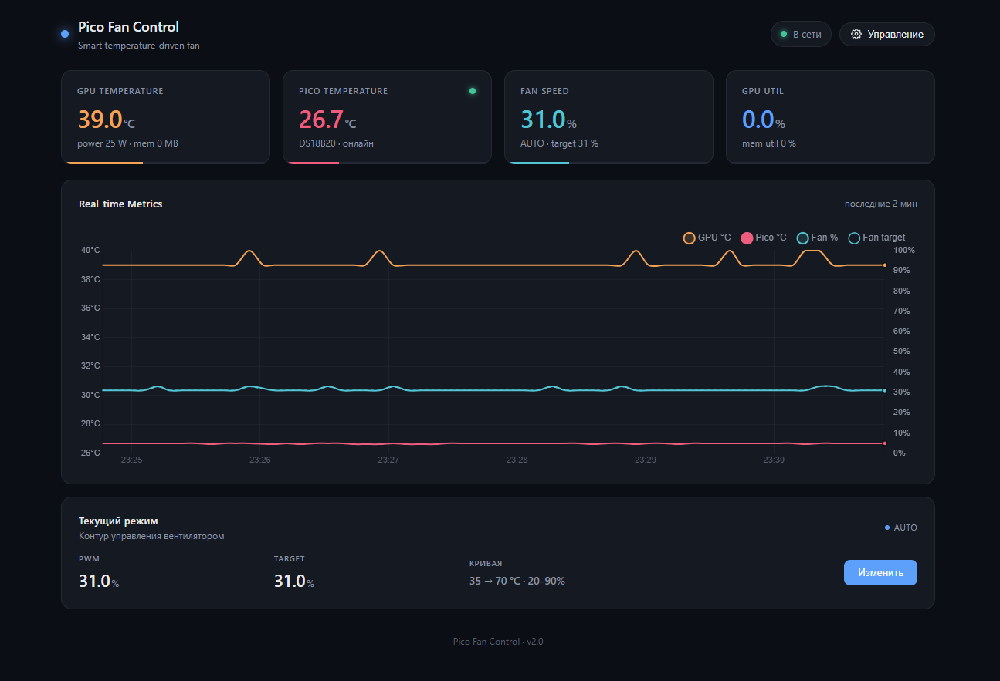
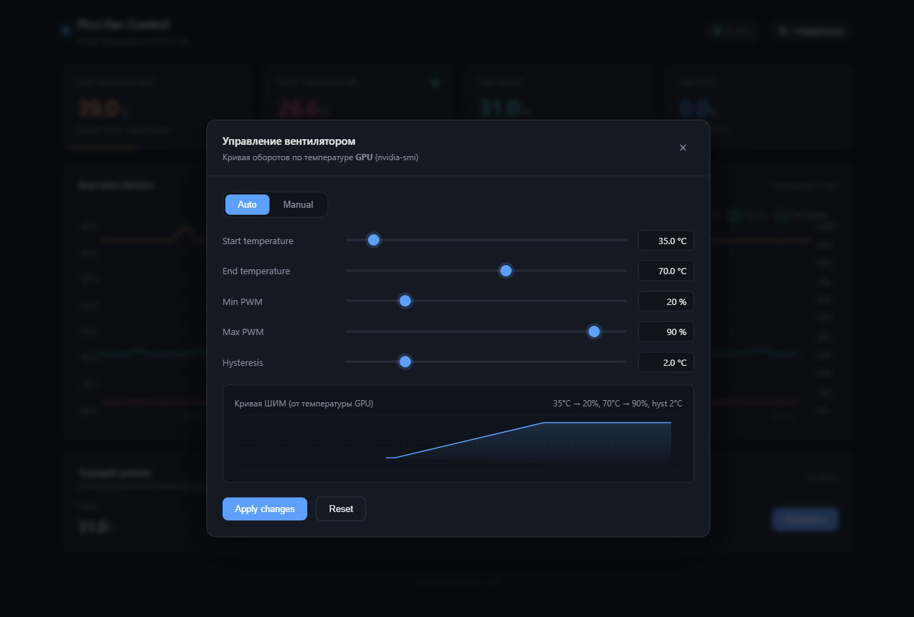

# Послушный вентилятор

## Схема подключения оборудования

Поскольку выводы Pico не могут обеспечить достаточный ток для непосредственного управления вентилятором, необходимо использовать схему драйвера:

1. **Вывод 1 (GND)**: Подключите к заземлению Pico и отрицательному полюсу ( − − ) вашего внешнего источника питания.
2. **Вывод 2 (База/Затвор)**: Подключите к выводу ШИМ Pico (например, GP0) через резистор 1 кОм Ω.
3. **Вывод 3 (Коллектор/Сток)**: Подключите к отрицательному выводу вашего вентилятора 5 В или 12 В.
4. **Противофазный диод**: Установите диод 1N4001 между положительным и отрицательным выводами вентилятора (серебряная полоса должна быть обращена к положительному полюсу), чтобы защитить схему от скачков напряжения.


## Схема подключения DS18B20

Датчик использует протокол 1-Wire, поэтому шина данных требует подтягивающего резистора номиналом \(4.7 \text{ кОм}\) между линией данных и питанием.

1. **GND (Земля)**: любой контакт GND на Pico (например, 3-й пин).
2. **VCC (Питание)**: пин 3V3(OUT) на Pico (например, 36-й пин).
3. **DATA (Данные)**: любой свободный пин GPIO (например, GPIO 16 или GPIO 22).
4. **Резистор**: соедините между контактом DATA и контактом VCC


## Подготовка

```powershell
python -m venv venv
.\venv\Scripts\Activate.ps1
pip install -r requirements.txt

cp .env.example .env
notepad .env   # заполните INFLUXDB_* и при необходимости FAN_PORT
```

## Запуск

```powershell
python service.py            # http://localhost:3000
python -m fan_control --help # справка по CLI модуля
python -m fan_control --list-ports
```

Все параметры читаются из `.env` (через `python-dotenv`) и могут быть
переопределены реальными переменными окружения, например
`INFLUXDB_HOST=10.0.0.5 python service.py`.

## Веб-интерфейс

После запуска откройте `http://localhost:3000`. Доступно:

- **KPI-карточки**: температура GPU (nvidia-smi), температура Pico (DS18B20 —
  только мониторинг), текущие обороты вентилятора, утилизация GPU.
- **График в реальном времени**: две оси Y — температура (°C) и обороты (%),
  пунктиром отображается целевое значение ШИМ, которое вычисляет контур
  управления.
- **Панель управления вентилятором**:
  - Режим **Auto** — ШИМ рассчитывается по **температуре GPU** (nvidia-smi).
  - Режим **Manual** — фиксированный ШИМ, игнорируя температуру.
  - Слайдеры: `Start temp` (°C GPU), `End temp` (°C GPU), `Min PWM` (%),
    `Max PWM` (%) и `Hysteresis` (°C).
  - Inline-превью кривой с текущими настройками.
  - Кнопка `Apply changes` сохраняет конфигурацию на сервере и применяется
    на следующем цикле опроса (≤ `POLL_INTERVAL` секунд).
  - Кнопка `Reset` откатывает форму к значениям с сервера.

Кривая автоматического режима линейна между `Start temp` и `End temp`,
`Min PWM` и `Max PWM` — её границы. `Hysteresis` добавляет запас
(в °C) к `Start temp` при остывании, чтобы избежать осцилляций вентилятора
вблизи нижнего порога.

> **Важно:** контур управления ориентируется на температуру **GPU** (nvidia-smi).
> Температура DS18B20 на Pico показывается в дашборде для мониторинга, но
> **не** влияет на обороты. Это сделано, чтобы вентилятор реагировал именно
> на нагрев GPU, а не на собственный нагрев рядом с корпусом.








