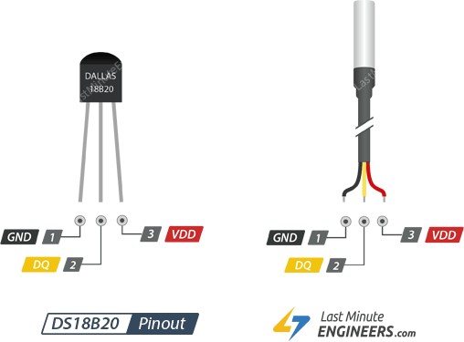

# Послушный вентилятор


## Подготовка

```powershell
python -m venv venv
.\venv\Scripts\Activate.ps1
pip install -r requirements.txt

```


## Схема подключения оборудования

Поскольку выводы Pico не могут обеспечить достаточный ток для непосредственного управления вентилятором, необходимо использовать схему драйвера:

1. **Вывод 1 (GND)**: Подключите к заземлению Pico и отрицательному полюсу ( − − ) вашего внешнего источника питания.
2. **Вывод 2 (База/Затвор)**: Подключите к выводу ШИМ Pico (например, GP0) через резистор 1 кОм Ω.
3. **Вывод 3 (Коллектор/Сток)**: Подключите к отрицательному выводу вашего вентилятора 5 В или 12 В.
4. **Противофазный диод**: Установите диод 1N4001 между положительным и отрицательным выводами вентилятора (серебряная полоса должна быть обращена к положительному полюсу), чтобы защитить схему от скачков напряжения.




## Схема подключения DS18B20

Датчик использует протокол 1-Wire, поэтому шина данных требует подтягивающего резистора номиналом \(4.7 \text{ кОм}\) между линией данных и питанием.

1. **GND (Земля)**: любой контакт GND на Pico (например, 3-й пин).
2. **VCC (Питание)**: пин 3V3(OUT) на Pico (например, 36-й пин).
3. **DATA (Данные)**: любой свободный пин GPIO (например, GPIO 16 или GPIO 22).
4. **Резистор**: соедините между контактом DATA и контактом VCC


## ToDo: Доработать fan_control.py

  - [x] Переделать в модуль
  - [x] Добавить выдачу текущих оборотов вентилятора
